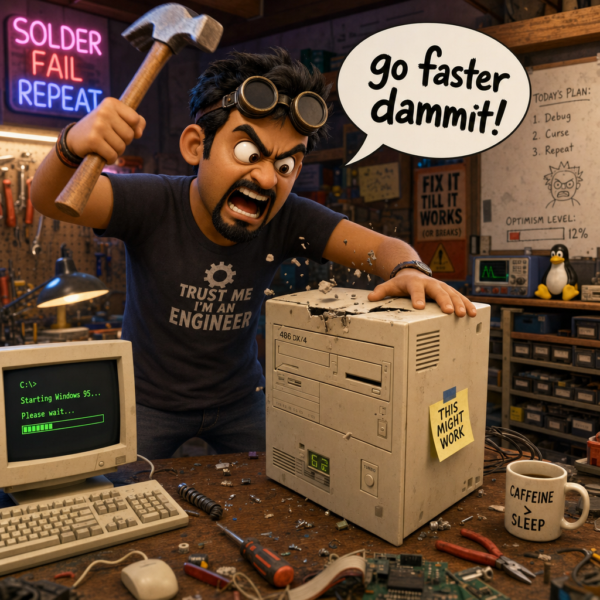

# StarCraft Match Fixer

This is a StarCraft 1.16.1 mod that forces a specific game speed and latency setting no matter what you selected in the menu.

What did you think it was? 😹

This is very useful to do when you want to run AIs that use BWAPI with auto-menu enabled. Since in that case, you can't edit the speed menu setting

This plugin is only active for online games like `UDP` or `Local PC`. It doesn't work for single player games.

You also have to make sure the plugin is enabled on both the server and client StarCraft instances, otherwise desync can happen and the game will instantly drop the other player.

## Easy Installation

1. Download latest [release]().
2. Install into your mod manager of choice. I recommend [Smart Loader](https://github.com/helloimhana123/starcraft-smart-loader), since I made it lol! 🤓
3. Use default settings to force `Fastest` speed. See additional settings below.

## Configuration

The mod comes with an ini file called `MatchFixer.ini` that should exist next to the `MatchFixer.dll`. It has the options:

* `GameSpeed`, set the game speed from 0 to 6.
* `LatencyFrames`, set number of latency frames. From 1 to 20.

Setting any of the values to `-1` will disable that part of the mod.

## LatencyFrames & Pluto

The reason I started making this mod is because [Pluto](https://github.com/tscmoo/pluto) requires a very specific value of latency frames. That value is `LatencyFrames = 1`. Without this, pluto will give an error that the latency is incorrectly set.

The issue is, normally when you are playing on local network, the only way to alter this latency value is to set the game speed to `Normal`. The weird thing here is that StarCraft sets this value silently in the background, based on what speed setting you chose. But of course, we humans always want to play on `Fastest`, since that is the norm.

To fix this issue, Match Fixer was created!

## Building

Run `Build.ps1` to build the DLL and create a zip file.

## AI

Made using AI. 💖 GPT-5.6 Terra and GPT-6 Sol was used to figure out what part of the StarCraft binary we needed to edit in order to get these results. DeepSeek was used for implementations after that.

## License

[GPL-2](https://www.gnu.org/licenses/old-licenses/gpl-2.0.en.html).
